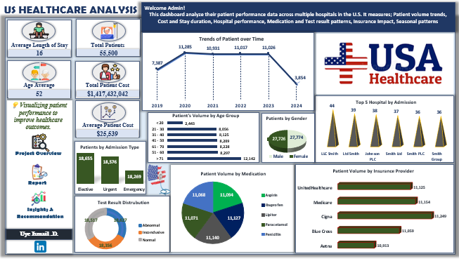

#  Healthcare Patient Performance Analysis

  
  
  

---

## 📌 Project Overview  
This project analyzes **patient performance data** across multiple U.S. hospitals (2019–2024).  
It focuses on **patient volumes, healthcare costs, hospital efficiency, insurance coverage, and treatment outcomes**.  
The goal is to provide executives with a **data-driven view** of patient care trends for better **resource allocation and healthcare planning**.  

---

## 🎯 Purpose  
- Evaluate **patient admission trends** across demographics, hospitals, and admission types.  
- Analyze **treatment costs, average stay durations, and insurance coverage gaps**.  
- Identify **high and low-performing hospitals** for benchmarking.  
- Uncover **patterns in medication usage and test result distributions**.  
- Provide **actionable recommendations** for cost reduction, patient satisfaction, and healthcare optimization.  

---

## 🎯 Objectives  
- Track **patient volume trends** over time (2019–2024).  
- Break down admissions by **age, gender, and hospital**.  
- Measure **average patient cost ($25,539)** and **average stay duration (16 days)**.  
- Assess **insurance coverage impact** on accessibility.  
- Highlight **top-performing vs underperforming hospitals**.  
- Investigate **test result distributions and medication patterns**.  

---

## 🛠️ Tools & Technologies  
- 💻 **Microsoft Excel** – Dashboard Design, Pivot Analysis, Visualizations  
- 📂 **Healthcare Dataset (2019–2024)** – Provided for analytical modeling  
- 📈 **Data Storytelling** – Transforming insights into recommendations  

---

## 🌐 Live Dashboard  
Experience the interactive dashboard live here:
[Click to view the live dashboard](https://1drv.ms/x/c/a145471cdb65b729/EUJwvMiMN4BHuoc1zodMpCkB9ITM1XKm_Wk0oRwsI230kw?e=vEYMgE)

---

## ❓ Key Business Questions Answered  
- 📊 How are patient numbers changing over time?  
- 🧑‍⚕️ Which age groups and genders dominate hospital admissions?  
- 🏥 Which hospitals have the **highest vs lowest patient volumes**?  
- 💰 What drives the **average treatment cost and stay duration**?  
- 💊 What are the most commonly used medications?  
- 🧪 What are the distributions of **test results** (Normal, Abnormal, Inconclusive)?  
- 🛡️ How does patient volume break down by insurance provider?  
- 🍂 Are there **seasonal/annual patterns** in admissions affecting resource planning?  

---

## 🖼️ Dashboard Preview 

---

## 🔑 Key Insights from Dashboard  
- **Total Patients:** 55,500  
- **Total Patient Cost:** $1.41B  
- **Average Patient Cost:** $25,539  
- **Average Length of Stay:** 16 days  
- **Average Age:** 52 years  

📌 **Trends & Patterns**  
- Patient volumes **peaked in 2020 (11,285)**, then dropped in 2024.  
- Majority admissions: **ages 51–70 (16,465 patients combined)**.  
- Gender distribution nearly equal: **Male (27,774)** vs **Female (27,726)**.  
- **Top hospitals**: LLC Smith, Ltd Smith, Johnson PLC.  
- **Low-volume hospitals**: Several with only 1 admission.  

📌 **Healthcare Performance**  
- **Medications:** Aspirin, Ibuprofen, Lipitor, and Paracetamol dominate.  
- **Test Results:** Balanced distribution — Normal (18,517), Abnormal (18,627), Inconclusive (18,356).  
- **Insurance:** Cigna (11,249) and Medicare (11,154) lead in patient volume.  

---

## 📊 Detailed Report  
- **Patient Trends:** Admissions surged during 2020–2023, likely due to pandemic influence.  
- **Hospital Performance:** Top 5 hospitals handled 230 patients, while many others had negligible admissions.  
- **Cost Drivers:** With **$1.41B spent**, treatment optimization is crucial.  
- **Insurance Dependency:** Certain providers dominate, creating concentration risks.  
- **Medication & Tests:** Heavy reliance on common drugs and high inconclusive test rates indicate areas for improvement.  

---

## ✅ Recommendations  
- **Optimize Resource Allocation:** Strengthen low-volume hospitals for better access.  
- **Cost Efficiency:** Investigate cost drivers and negotiate better medication procurement.  
- **Insurance Partnerships:** Expand coverage with insurers to reduce patient out-of-pocket expenses.  
- **Improve Diagnostics:** Address **18k+ inconclusive tests** with advanced medical equipment.  
- **Seasonal Planning:** Use historic peaks (2020–2023) to forecast staffing and resource needs.  

---

## 🚀 How to Use This Project  
1. 📂 Open the Excel file to access the interactive dashboard.  
2. 🔍 Use slicers/filters to explore data by **year, hospital, gender, or admission type**.  
3. 📊 Review pivot tables for detailed insights behind visualizations.  
4. 📝 Apply findings for **healthcare planning, cost optimization, and hospital benchmarking**.  

---

## 🏁 Conclusion  
This project demonstrates how **data analytics empowers healthcare decision-making**.  
By analyzing admissions, costs, insurance, and outcomes, hospitals can improve **efficiency, affordability, and patient care quality**.  

---

🔗 I encourage you to explore the dashboard, test different filters, and discover how data-driven decision-making can transform business strategies.  

---

## ✍️ Author  
**Ismail Uye – Data Analyst | Biochemist | Data Enthusiast**  

I’m passionate about turning raw datasets into meaningful insights 📊. With hands-on experience in **Excel**, **SQL**, and **Power BI**, I enjoy analyzing, visualizing, and storytelling with data to support smarter business decisions 🚀.  

---

🔗 **Let’s Connect**  
- 🌐 [LinkedIn](https://www.linkedin.com/in/uye-ismail-d)  
- 📧 uyedanzismuye@gmail.com  
- 📧 uyeismaildanzismuye@gmail.com  

💬 *“The goal is to turn data into information, and information into insight.”* – Carly Fiorina  

---

## 🙏 Closing Note  
Thank you for taking the time to explore this project 💡.  
I hope the insights and recommendations spark new ideas and inspire smarter decisions.  

Feel free to ⭐ this repo if you found it useful, and don’t hesitate to explore my other projects for more data stories 📊✨.  

I’m always open to collaboration, feedback, and knowledge-sharing; let’s connect and build something impactful together! 🤝  

---
